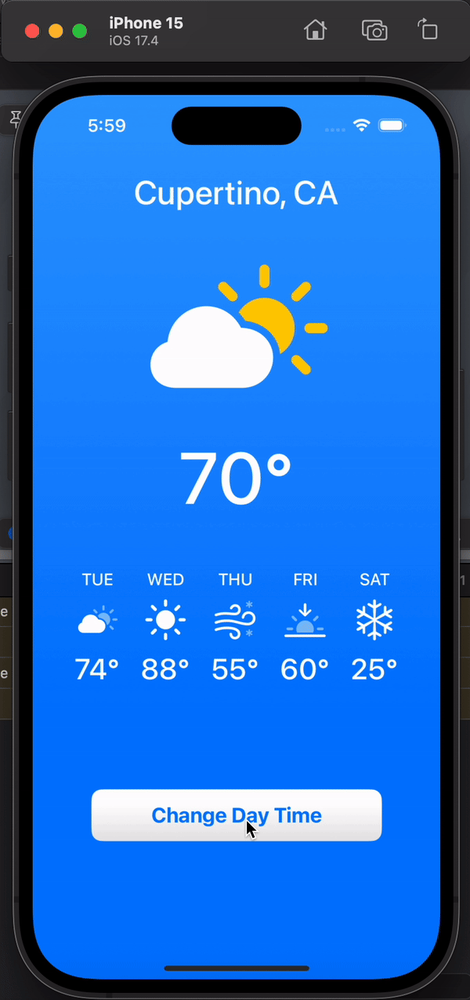

# SwiftUI Weather App

Welcome to my first SwiftUI project! This weather app is the result of my initial steps in learning SwiftUI. It's a simple application that displays hardcoded weather information and features a day/night mode toggle.

## Features

- Display hardcoded weather information
- Toggle between day and night modes
- Simple and intuitive user interface

## Requirements

To run this project, you need:

- Xcode 13 or later installed on your macOS device
- Basic understanding of Swift programming language
- Eagerness to learn and experiment with SwiftUI!

## Installation

1. Clone or download this repository to your local machine.
2. Open the project in Xcode by double-clicking the `.xcodeproj` file.
3. Build and run the project using the simulator or your physical device.

## Preview

## Resources

- [SwiftUI Documentation](https://developer.apple.com/documentation/swiftui) - Official documentation for SwiftUI provided by Apple.

## Contributing

I'm a beginner in SwiftUI, and contributions from experienced developers are highly appreciated! If you have any suggestions, feedback, or improvements for this project, feel free to open an issue or submit a pull request.

## License

This project is licensed under the MIT License - see the [LICENSE](LICENSE) file for details.

